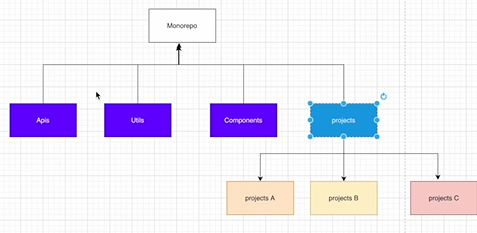

# monoreop

1、概念

2、一些文档

[https://pnpm.io/zh/workspaces](https://pnpm.io/zh/workspaces)

[https://github.com/vuejs/create-vue](https://github.com/vuejs/create-vue)

[https://github.com/vitejs/vite](https://github.com/vitejs/vite)

3、搭建

文档准备

安装pnpm

workspace的best practise

4、实战pnpm monorepo

分别构建好之后，在package.json里面命名模块名称，在需要引入的地方通过`pnpm add xxxName`即可

<!-- npm init vue@3  pnpm-monorepo -->

<!-- 添加pnpm-workspace.yaml -->

<!-- https://github.com/conferer/vue-workspace -->